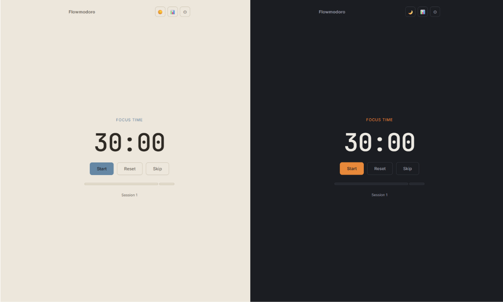
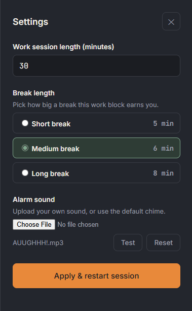
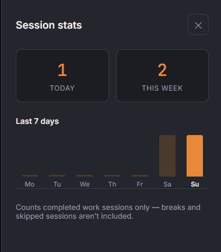

# Flowmodoro

A Pomodoro-style focus timer with one twist: instead of the fixed
25-minute-work / 5-minute-break split, **you set your own work length**,
and the app calculates proportional break options for you.

Built with plain HTML, CSS, and JavaScript — no frameworks, no build step —
as a learning project to practice core web development fundamentals.

**🔗 [Try it live](https://dustineronp-dev.github.io/Pomodoro-App-Web-only-Version-/)**

## Screenshots

| Timer | Settings | Stats |
|---|---|---|
|  |  |  |

## Features

- **Custom work sessions** — set any length from 1 to 240 minutes.
- **Scaled break presets** — choosing a work length generates three break
  options sized to it:
  - Short break — 15% of work time
  - Medium break — 20% of work time
  - Long break — 25% of work time

  Example: a 60-minute work session offers ~9 / 12 / 15-minute breaks.
- **Session map** — a visual strip showing the shape of your current
  work/break cycle, filling in as time passes.
- **Custom alarm sound** — upload your own audio clip to play when a
  work or break phase ends. Saved in the browser (`localStorage`) so it
  persists between visits.
- **Desktop notifications** — get notified when a phase ends even if
  the tab isn't focused. Falls back gracefully if denied or unsupported.
- **Session stats** — tracks completed work sessions and shows
  today's count, this week's count (Mon–Sun), and a 7-day bar chart.
- **Spacebar shortcut** — press Space to start/pause from anywhere
  (ignored while typing in an input).
- **Light/dark theme toggle** — defaults to dark, persists your choice.
- **Start / Pause / Reset / Skip** controls.

## Tech

- HTML5
- CSS3 (custom properties, flexbox, no framework)
- Vanilla JavaScript (`setInterval` timer loop, `localStorage`, `FileReader`,
  the Notification API)

## Running it locally

No build tools needed. Either:

1. Open `index.html` directly in a browser, **or**
2. Serve it locally for a cleaner experience (some browsers restrict
   `localStorage` on `file://` URLs):

   ```bash
   python3 -m http.server 8080
   ```

   then visit `http://localhost:8080`.

## Project structure

```
.
├── index.html       # markup
├── style.css        # design system + layout + light/dark themes
├── script.js        # timer engine, break-preset logic, stats, settings, alarm/notification handling
├── screenshots/      # README images
└── README.md
```

## Why this project

This was built as a hands-on exercise to strengthen core JavaScript and
git fundamentals — DOM manipulation, timers, state management, and
localStorage — ahead of applying for junior developer roles. Commit
history is kept intentionally granular (structure → logic/styling →
docs/polish) and development was tracked through GitHub Issues and
Pull Requests to mirror a real team workflow, even working solo.

## Possible future improvements

- Multiple work/break cycles in a row before a longer rest (the classic
  "4 pomodoros then a long break" pattern)
- Export/import stats data
- Mobile-friendly install (PWA support)
- More theme options beyond light/dark